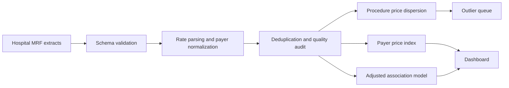

# Hospital Price Transparency Analytics

[](https://github.com/sagarmandavkar-UX/hospital-price-transparency-analytics/actions/workflows/tests.yml)


A healthcare analytics case study for converting messy hospital machine-readable rates into an auditable price-variation analysis. The pipeline normalizes currency fields, rejects invalid observations, deduplicates rates at the correct grain, benchmarks payers and hospitals, estimates interpretable price associations, and produces an operational outlier queue.

> Bundled rates and hospital names are synthetic. The repository demonstrates a production-oriented workflow without making claims about real Tennessee facilities.

## Executive result

In the seeded demo, the median procedure has roughly a **2.69× maximum-to-minimum published rate spread**. The workflow separates data-quality exclusions from analytical results and highlights rates at least 1.5× above their procedure/payer peer benchmark.

## Business questions

- How much do negotiated prices vary for the same procedure?
- Which payer categories have systematically higher normalized rates?
- Are rurality or hospital size associated with price after procedure and payer controls?
- Which rates should contract analysts or data-quality teams review first?

## What this project demonstrates

- Robust parsing of currency-formatted and missing values.
- Duplicate-grain enforcement at hospital/procedure/payer level.
- Procedure-normalized payer price indices.
- Log-price regression with procedure and payer controls.
- Bootstrap interval for rural-versus-urban median differences.
- Benchmark-relative high-price review queue.
- Filterable Streamlit dashboard with downloadable clean data.

## Architecture



## Repository structure

```text
├── analysis.py              # cleaning, benchmarking, modeling, exports
├── app.py                   # filterable price-transparency dashboard
├── docs/                    # methodology, dictionary, executive memo
├── outputs/                 # clean rates, scorecards, outlier queue
├── test_project.py
├── Dockerfile
├── Makefile
└── requirements.txt
```

## Quick start

```bash
git clone https://github.com/sagarmandavkar-UX/hospital-price-transparency-analytics.git
cd hospital-price-transparency-analytics
python -m venv .venv
source .venv/bin/activate
make setup
make analyze
make test
make dashboard
```

## Required input fields

`hospital`, `procedure_code`, `payer`, `negotiated_rate`, `rural`, and `beds`. The dashboard accepts a CSV matching this contract.

## Interpretation guide

- `max_to_min_ratio` measures within-procedure spread and is sensitive to extreme values.
- `median_price_index` equals a payer's median rate divided by the corresponding procedure median.
- `relative_to_benchmark` compares a row with its procedure/payer median.
- Model coefficients are associations, not evidence that hospital size or rurality causes price differences.

## Productionization roadmap

Ingest current CMS-compliant files; retain plan name, code system, setting, rate type, and source URL; join facility identifiers to CMS Provider of Services and rural-urban metadata; validate comparable service settings; and weight contract-level findings with claims volume where available.

## Portfolio talking points

- Built a transparent cleaning layer that reports every invalid or duplicate rate removed.
- Modeled price variation without hiding procedure and payer mix.
- Turned statistical output into a prioritized hospital-rate review queue.

See [Methodology](docs/METHODOLOGY.md), [Data dictionary](docs/DATA_DICTIONARY.md), and [Executive memo](docs/EXECUTIVE_MEMO.md).
